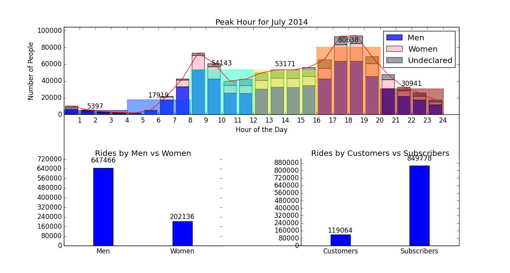

# Assignment #8

## Part 1:

My plot is from our summer bootcamp, where we had to re-create a given plot in python. The original file can be seen [here](Alan_Polson_Core_Challenge.py). An [ipython notebook](Assignment8.ipynb) in which I started modifying the plot is also included. If you wish to run these files, please remember t download the [citibike data for July 2014](https://s3.amazonaws.com/tripdata/201406-citibike-tripdata.zip) as well.
The final plot looks like this:

----
## Part 2:

I was given 3 plots to review, belonging to [Venkat](https://github.com/vrmotupalli/PUI2015_vmotupalli/tree/master/HW8), [Denis](https://github.com/Cuspian/PUI2015_dkhryashchev/blob/master/HW8/GHG%20plot.png), and [YiningFan](https://github.com/YiningFan/PUI2015_yf903/blob/master/HW8/yf903_plot.png).
Click each person's name to access their review:

1. [YiningFan](yf903_Review.md)
2. [Denis](dk2926_Review.md)
3. [Venkat](vm1218_Review.md)
