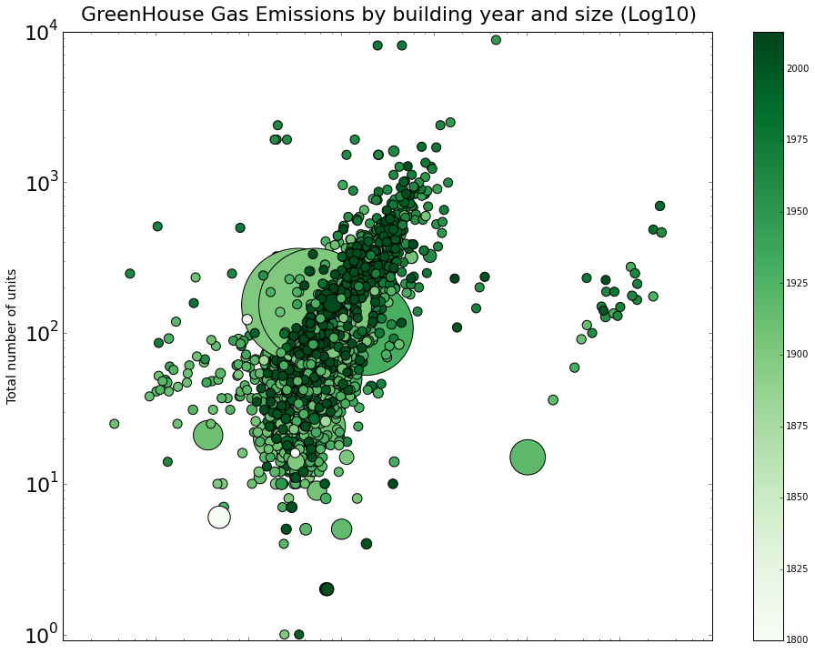

# Review of Denis's plot 

[*source*](https://github.com/Cuspian/PUI2015_dkhryashchev/blob/master/HW8/GHG%20plot.png) 

----
## INITIAL OBSERVATIONS
Looks cool! Not too sure what means what. If not for the Readme file, would not even know what was being measured against what. A lot has to be assumed. But color scheme is nice, and if a few things are rectified, it will be top notch.

----
## CLARITY
1. A legend is needed for all items, not just construction years, and for that, too, 'Year of Construction' needs to explicitly mentioned.
2. Units needed for both axes.
3. you ought to put the independent variable on the X axis and the dependent variable on the Y axis, followed by the other dependent variables being measured represented in color and size (I'm not sure that these variables are.. see points 5,6,7 below) 
4. Title and Y axis label is confusing. According to Title: Green House Gas emissions is on the Y axis, and both building year and size are on the X axis. (when actually, 'year of building' is represented by color, but anyway...) Size is on the log10 scale according to the title, but the y-axis shows the log scale.
5. So... Total number of units is for greenhouse gases? it seems more like a 'building size' measurement.
6. What is the bubble size measuring? Building size? amount of greenhouse gases? if so, what is the x-axis measuring? nothing? then how does each bubble have an x component? Why isn't it all in one line, along the Y-axis? Are you measuring 4 dimensions and only mentioned 3? or is one of the parameters doubling up as the x component? if so, which one? You need to specify.
7. Label and units needed for x axis. Or not. I don't know anymore.

----
## AESTHETIC
Love it. Great idea, to use shades of green... like poison gas. Would've been even cooler if you actually added in light blue background color, so that it seems like the gases are poisoning the atmosphere or something...

Even so... what the color is measuring is strange. Why should it get darker green when it grows younger? The display does not correspond to the parameter. It would've been better to measure 'Per Capita annual tonnage of carbon emitted' in the green spectrum.

----
## HONESTY
* Since I can't understand the plot, its difficult to gauge honesty.
* It is definitely misleading to use color change for year... as in context of carbon emissions, the natural assumption is that darker is worse.. when in fact, it is just indicative of year.

----
## SUGGESTIONS
* Be explicit in your labeling. Especially when it comes to adding and labeling legends and axes.

* Make sure your independent and dependent variables are on the X and Y axes, respectively.

* Here is one way of doing it:

 1. *X axis (independent variable):* **Building year** (its a weird X axis... but it is definitely not a dependent variable.)  
 2. *Y axis (dependent variable):* **Building Size** (in no. of units/building)
 3. *Bubble size (another dependent Variable):* **Total amount of carbon Emitted annually** (in Metric tonnes)
 4. *Color Spectrum (another dependent variable):* **Amount of Carbon Emitted normalized per capita or per units in a building.**(in metric tonnes/units) 