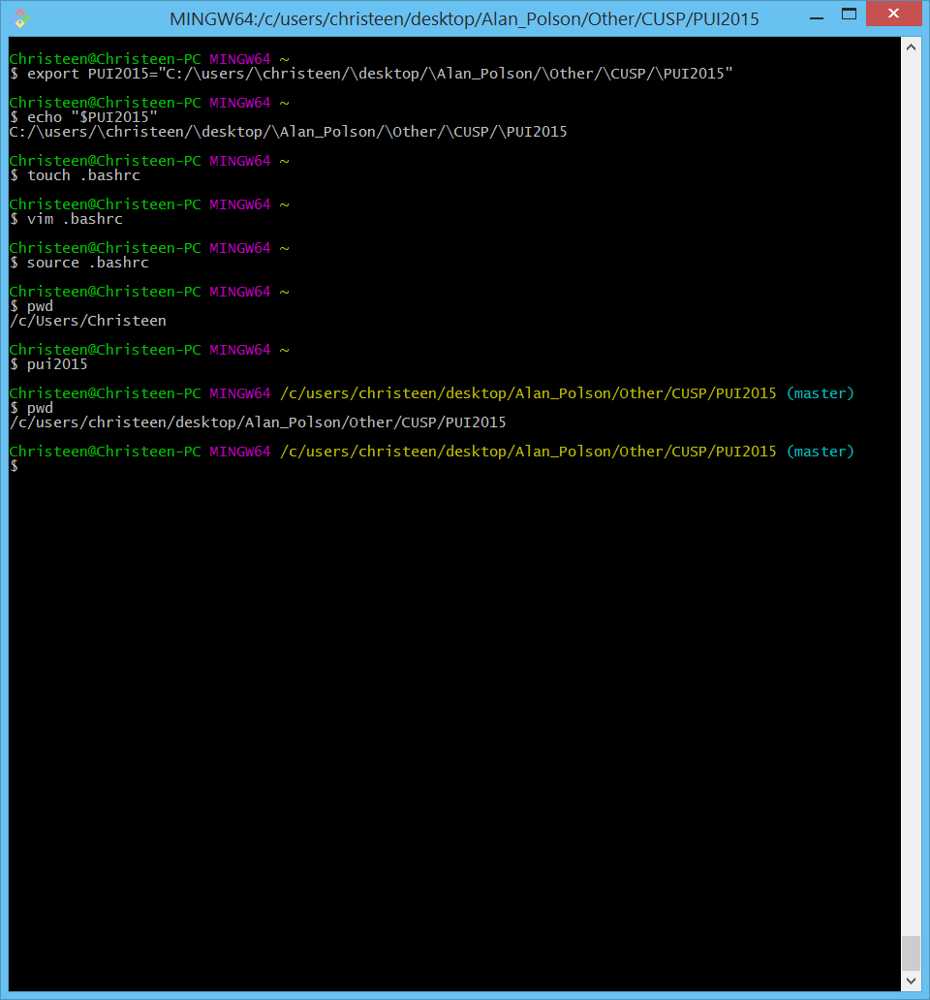

# Windows Environment setup instructions:

To set up the alias in my Windows machine, I took the following steps:

1) create a .bashrc file

touch .bashrc

2) Edit the bashrc file

vim .bashrc

3) Add the below lines in vim: 

	a) Create environmental variable

	   export PUI2015="C:/\users/\christeen/\desktop/\Alan_Polson/\Other/\CUSP/\PUI2015"

	b) Create an alias pointing to this env variable

   	   alias pui2015='cd $PUI2015'

Vim Commands: (if you are unfamiliar with vim, you basically add the line by pressing 'i', typing in the line, then pressing 'esc', followed by ':', 'w', 'q' and 'enter')

4) .bashrc will load as soon as your bash runs, but if you don't want the hassle of closing bash n reoping it, we can just 'refresh' it by keying in the following command in bash:

source .bashrc

5)Testing

Here is a screenshot of my alias in action:

